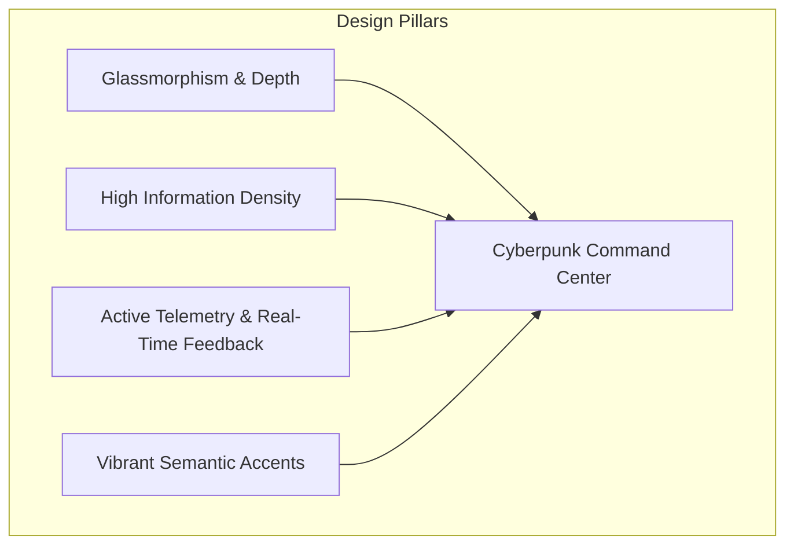
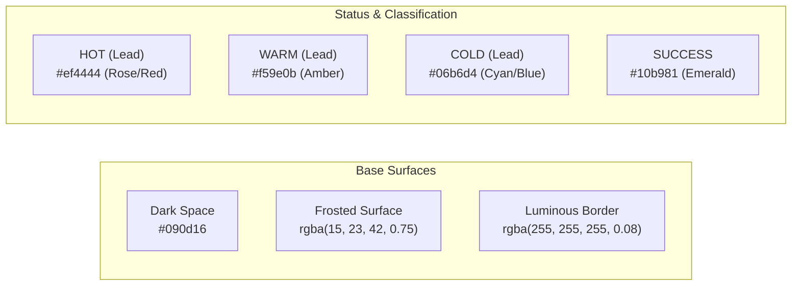
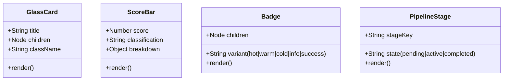
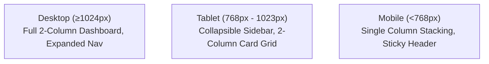

# FirmScout AI — UI/UX Design System Specification 🎨

> **Aesthetic Archetype**: Cyberpunk Executive Cockpit & Glassmorphism  
> **Theme**: Deep Dark Mode with High-Vibrancy Neon Accents  
> **Stylesheet**: `client/src/styles/global.css` (28KB Vanilla CSS)  

---

## 1. Design Philosophy & Aesthetic Identity

FirmScout AI is engineered to feel like a **futuristic sales intelligence command center**. Rather than imitating generic, flat SaaS dashboards, the interface blends **glassmorphism**, **high-density data architecture**, and **responsive micro-interactions** to create an engaging, premium user experience.



### Core Design Pillars
1. **Depth Through Translucency**: Layered frosted glass panels (`backdrop-filter: blur(12px)`) separate foreground data from deep background gradients, establishing clear visual hierarchy.
2. **Designing for Asynchronous AI**: Long-running multi-agent pipelines (15–30s) are visually engaging with live step-by-step trackers, pulsing stage indicators, and zero layout shift.
3. **Data Density Without Clutter**: High-impact metrics (scores, empirical findings, website sub-scores) are formatted into clean card grids, color-coded badges, and stacked progress bars.
4. **Instant Actionability**: Primary actions (copying outreach pitches, launching pipeline jobs, changing lead status) require single clicks with explicit visual feedback (e.g., *"Copied!"* confirmations).

---

## 2. Design Tokens & Foundations

### 2.1 Color Palette & Token Hierarchy

FirmScout AI is built on a dark palette accented by targeted neon highlights for lead classification and operational status:



#### Color Token Reference Table

| Category | Token Name | Hex / CSS Value | Semantic Role |
| :--- | :--- | :--- | :--- |
| **Surfaces** | `--bg-primary` | `#090d16` | Main application backdrop |
| | `--bg-card` | `rgba(15, 23, 42, 0.75)` | Translucent card surface |
| | `--bg-card-hover` | `rgba(30, 41, 59, 0.85)` | Elevated hover card state |
| | `--bg-input` | `rgba(15, 23, 42, 0.90)` | Form controls and inputs |
| **Borders** | `--border-subtle` | `rgba(255, 255, 255, 0.08)` | Standard component borders |
| | `--border-focus` | `rgba(6, 182, 212, 0.40)` | Interactive focus ring |
| **Typography** | `--text-primary` | `#f8fafc` | Headings and dominant text |
| | `--text-secondary` | `#94a3b8` | Body copy and descriptions |
| | `--text-muted` | `#64748b` | Labels, captions, and hints |
| **Accents** | `--accent-cyan` | `#06b6d4` | Primary brand accent & Cold leads |
| | `--accent-blue` | `#3b82f6` | Links, primary CTAs, and info tags |
| | `--accent-emerald` | `#10b981` | Completed states & high scores |
| | `--accent-amber` | `#f59e0b` | Warm leads & warnings |
| | `--accent-red` | `#ef4444` | Hot leads & error states |
| | `--accent-violet` | `#8b5cf6` | AI intelligence & pipeline tags |

---

### 2.2 Typography Architecture

Typography utilizes a high-legibility system sans-serif font stack paired with a tabular monospace stack for scores, tokens, and telemetry:

- **Primary Sans Stack**: `Inter, -apple-system, BlinkMacSystemFont, "Segoe UI", Roboto, "Helvetica Neue", sans-serif`
- **Monospace Telemetry Stack**: `ui-monospace, "SF Mono", Menlo, Monaco, Consolas, "Liberation Mono", monospace`

#### Typographic Hierarchy

```text
Display Title  ── 2.50rem (40px) ── Bold (700)     ── Hero & Landing Titles
Heading 1      ── 1.75rem (28px) ── SemiBold (600) ── Page Headers
Heading 2      ── 1.25rem (20px) ── SemiBold (600) ── Card Titles & Sections
Heading 3      ── 1.00rem (16px) ── Medium (500)   ── Subheaders & Modal Titles
Body           ── 0.9375rem (15px)─ Regular (400)  ── Primary Content & Form Fields
Small / Meta   ── 0.8125rem (13px)─ Regular (400)  ── Table Cells & Secondary Text
Caption / Tag  ── 0.75rem (12px)  ── Medium (500)   ── Badges, Tokens & Timestamps
```

---

### 2.3 Spacing, Elevation & Glassmorphic Radii

- **Grid System**: 8-point modular scale (`0.25rem` [4px], `0.5rem` [8px], `0.75rem` [12px], `1rem` [16px], `1.5rem` [24px], `2rem` [32px], `3rem` [48px]).
- **Border Radii**:
  - `var(--radius-sm)`: `8px` — Buttons, form inputs, badges.
  - `var(--radius-md)`: `12px` — Cards, modals, progress containers.
  - `var(--radius-lg)`: `16px` — Large hero containers & dashboards.
  - `var(--radius-full)`: `9999px` — Pill buttons & status dots.
- **Glass Shadows**:
  - Soft Card Shadow: `0 8px 32px 0 rgba(0, 0, 0, 0.37)`
  - Active Glow: `0 0 15px rgba(6, 182, 212, 0.25)`

---

## 3. Core Component Specifications



### 3.1 GlassCard (`GlassCard.jsx`)
The foundational structural unit across all views.
- **CSS Specification**:
  ```css
  .glass-card {
    background: rgba(15, 23, 42, 0.75);
    backdrop-filter: blur(12px);
    -webkit-backdrop-filter: blur(12px);
    border: 1px solid rgba(255, 255, 255, 0.08);
    border-radius: var(--radius-md);
    padding: 1.5rem;
    box-shadow: 0 8px 32px 0 rgba(0, 0, 0, 0.37);
    transition: transform 0.2s ease, border-color 0.2s ease;
  }
  .glass-card:hover {
    border-color: rgba(6, 182, 212, 0.25);
    transform: translateY(-2px);
  }
  ```

---

### 3.2 ScoreBar & Metric Breakdown (`ScoreBar.jsx`)
Visualizes the overall 0–100 lead score and its four constituent components.
- **Color Coding**:
  - `HOT` (≥70): Red/Rose gradient (`#ef4444` to `#f43f5e`) with pulsing glow.
  - `WARM` (45–69): Amber gradient (`#f59e0b` to `#fbbf24`).
  - `COLD` (<45): Cyan/Slate gradient (`#06b6d4` to `#64748b`).
- **Sub-Score Breakdown**: Displays individual point contributions (ICP Fit [30], Digital Gap [25], Automation Potential [25], Buying Signals [20]) with proportional progress bars.

---

### 3.3 Badge System (`Badge.jsx`)
Pill-shaped indicator for statuses and classifications.
- **Variants**:
  - `variant="hot"`: Red background (`rgba(239, 68, 68, 0.15)`), red border and text.
  - `variant="warm"`: Amber background (`rgba(245, 158, 11, 0.15)`), amber border and text.
  - `variant="cold"`: Cyan background (`rgba(6, 182, 212, 0.15)`), cyan border and text.
  - `variant="success"`: Emerald background (`rgba(16, 185, 129, 0.15)`), emerald border and text.
  - `variant="info"`: Blue background (`rgba(59, 130, 246, 0.15)`), blue border and text.

---

### 3.4 Multi-Stage Pipeline Tracker (`PipelineProgress.jsx`)
Visual step-indicator showing live job advancement across the 8 stages.
- **Completed Stages**: Solid emerald checkmark icon, crisp border, 100% opacity.
- **Active Stage**: Cyan glowing border, spinning activity ring, pulsing glow.
- **Pending Stages**: Low opacity (`0.4`), dashed border, muted icon.

---

### 3.5 Outreach Copywriter Studio (`LeadDetail.jsx`)
Tabbed interface for multi-channel sales copywriting:
- **Email Tab**: Displays formatted Subject Line and structured Message Body.
- **LinkedIn Tab**: Compact InMail script (<300 chars) with connection notes.
- **WhatsApp Tab**: Direct, conversational mobile message template.
- **Copy Action**: Prominent button with instant green *"Copied to Clipboard!"* state transition.

---

## 4. Micro-Interactions & Animation Standards

To ensure the interface feels responsive and alive, animations are applied with strict restraint:

```css
/* Smooth Fade In */
@keyframes fadeIn {
  from { opacity: 0; transform: translateY(6px); }
  to { opacity: 1; transform: translateY(0); }
}

/* Slide Up for Hero & Cards */
@keyframes slideUp {
  from { opacity: 0; transform: translateY(16px); }
  to { opacity: 1; transform: translateY(0); }
}

/* Pulsing Active Stage Ring */
@keyframes pulseGlow {
  0%, 100% { box-shadow: 0 0 0 0 rgba(6, 182, 212, 0.4); }
  50% { box-shadow: 0 0 0 8px rgba(6, 182, 212, 0); }
}

/* Standard Durations */
:root {
  --anim-fast: 150ms cubic-bezier(0.4, 0, 0.2, 1);
  --anim-normal: 250ms cubic-bezier(0.4, 0, 0.2, 1);
  --anim-enter: 350ms cubic-bezier(0, 0, 0.2, 1);
}
```

---

## 5. Responsive Breakpoints & Layout Architecture



- **Mobile Viewport (<768px)**:
  - Grid columns collapse into a single stacked flow.
  - Tables switch to horizontal scroll wrappers.
  - Primary navigation collapses into a sticky header.
  - Touch targets maintain a minimum dimension of `44px × 44px`.
- **Tablet (768px – 1023px)**:
  - Lead details split into a balanced 2-column layout.
  - Sidebar expands with compact icon + label format.
- **Desktop (≥1024px)**:
  - Full-width executive grid with dedicated research and outreach panes.
  - Hover states activated with smooth transitions.

---

## 6. Accessibility & Usability Safeguards

1. **WCAG Contrast Ratios**: All foreground body text (`#f8fafc`, `#94a3b8`) on card backgrounds (`rgba(15, 23, 42, 0.75)`) exceeds the **WCAG AA 4.5:1 ratio**.
2. **Dual-Coding Signals**: Color is never the sole indicator of status. Lead classifications (`HOT`, `WARM`, `COLD`) always combine color with text labels and numeric score ranges.
3. **Keyboard Accessibility**: Interactive cards, tab selectors, and buttons have visible focus rings (`box-shadow: 0 0 0 2px var(--accent-cyan)`).
4. **Reduced Motion**: Respects `prefers-reduced-motion: reduce` by disabling transitions and slide-up keyframes for sensitive users.
