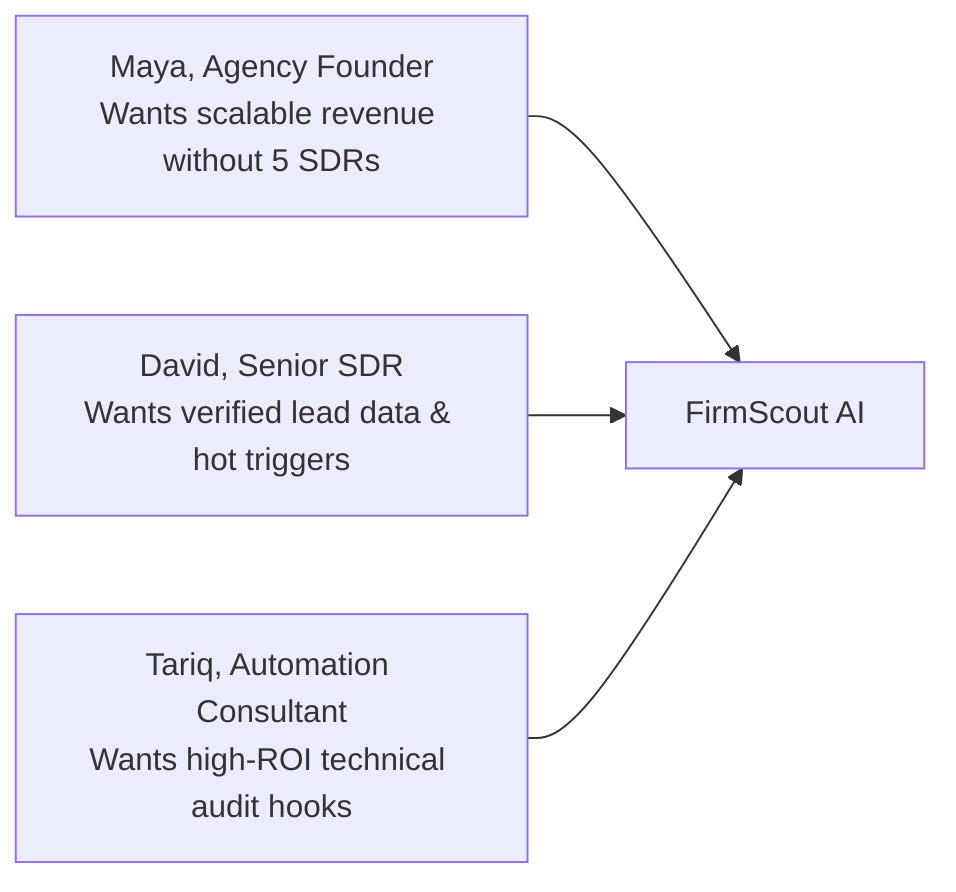
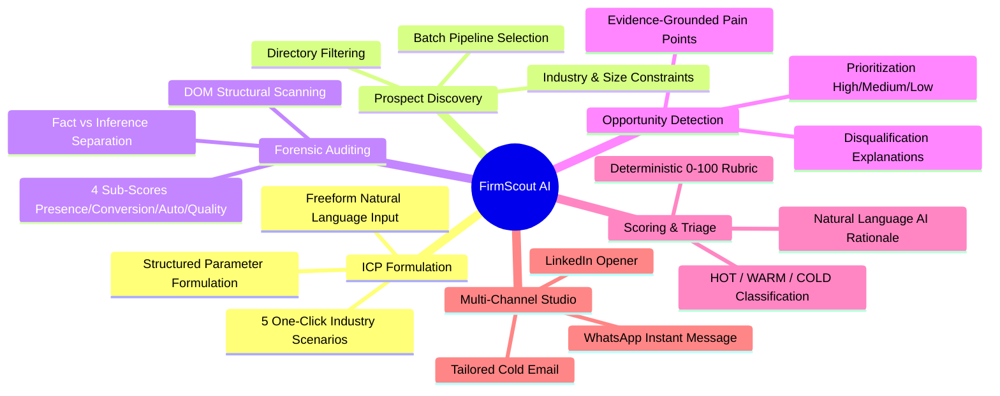
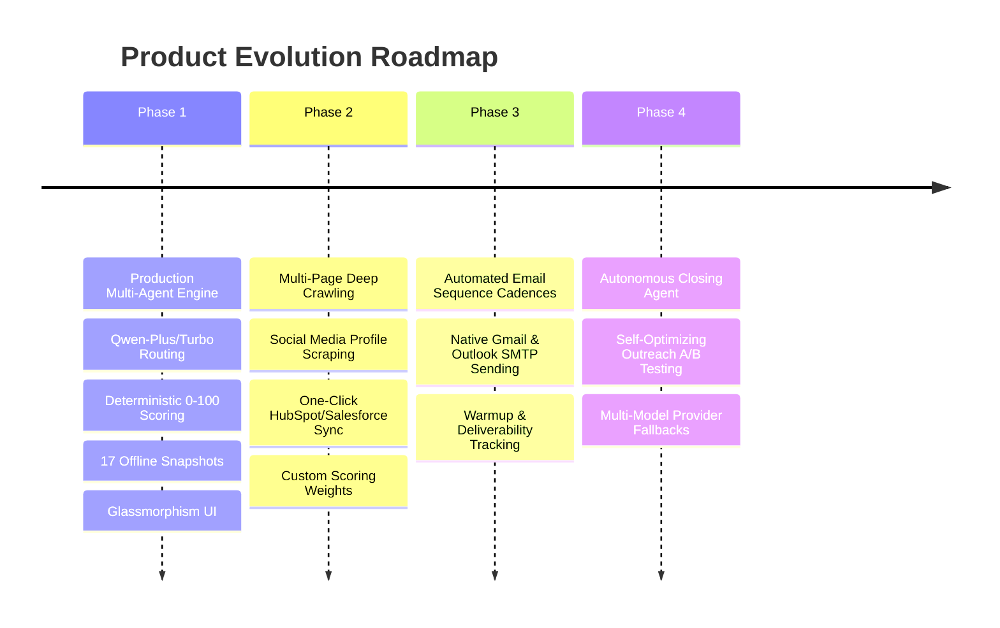

# FirmScout AI — Product Strategy & Requirements Document 🎯

> **Product**: FirmScout AI  
> **Classification**: B2B Sales Intelligence & Multi-Agent Outbound Platform  
> **Status**: Production Reference Specification  

---

## 1. Product Vision & Strategic Positioning

### The Vision
To transform B2B outbound sales from high-volume, generic spam into **hyper-personalized, evidence-grounded consultative selling**.

### The Opportunity
Every day, B2B agencies, software consultancies, and digital service providers waste hundreds of hours manually researching prospects, auditing websites, and trying to draft personalized emails. The alternative is mass blast sequences that achieve sub-1% reply rates and burn domain reputation.

FirmScout AI bridges this gap with an autonomous **7-agent AI pipeline**. It takes a simple business description or directory listing, forensically inspects the target's digital footprint, identifies concrete operational pain points, calculates an objective 0–100 lead score, and synthesizes multi-channel outreach pitches citing real, verifiable evidence.

---

## 2. Target User Personas

### Persona 1: Maya, Digital Agency Founder
- **Background**: Runs a 12-person digital agency specializing in conversion-focused websites, booking engines, and workflow automation.
- **Pain Points**: Lacks the budget to hire an army of SDRs. Spends weekends manually auditing local business websites to find clients who need redesigns or booking systems.
- **Goals**: Wants a system that ingests an ICP once and automatically surfaces 20 qualified, high-ticket prospects every week with ready-to-send pitches.

### Persona 2: David, Sales Development Representative (SDR)
- **Background**: Works at a mid-tier B2B software consultancy selling CRM implementations and custom automation integrations.
- **Pain Points**: Expected to generate 50 qualified opportunities a month. Spends 40 minutes per prospect digging through LinkedIn, looking for contact numbers, and trying to find a compelling sales hook.
- **Goals**: Needs rapid qualification—knowing immediately whether a lead is `HOT`, `WARM`, or `COLD` before investing time writing outreach.

### Persona 3: Tariq, Independent Workflow & AI Consultant
- **Background**: Specializes in building custom WhatsApp chatbots, CRM automations, and appointment reminders for healthcare clinics and professional service firms.
- **Pain Points**: Prospective clients don't understand abstract technology; they only care about solved problems. Writing bespoke proposals for cold prospects is too time-consuming.
- **Goals**: Wants empirical, data-backed evidence (e.g., *"Your site has 3 contact forms but zero WhatsApp links or automated booking engines"*) to immediately demonstrate value.

---

## 3. The Core Problem: The B2B Outbound Crisis

B2B outbound sales is broken across three structural dimensions:

| Friction Point | Current Industry Reality | FirmScout AI Solution |
| :--- | :--- | :--- |
| **1. Information Blindness** | Reps guess what a business needs based on company size or industry alone, leading to generic pitches. | **Forensic DOM & Content Auditing**: Cheerio parses 10+ empirical signals (booking forms, WhatsApp tags, CRM pixels). |
| **2. Subjective Qualification** | Reps prioritize leads based on "gut feeling" or company prestige, frequently targeting businesses that have no budget or already have in-house IT. | **Deterministic 0–100 Scoring**: Rubric evaluating ICP Fit, Digital Gap, Automation Potential, and Buying Signals. |
| **3. Cold Email Fatigue** | Prospects receive dozens of identical *"Hope this email finds you well... let's hop on a call"* messages every week. | **Evidence-Referenced Outreach**: Every pitch explicitly references observed technical facts from the prospect's actual site. |

---

## 4. Key Value Propositions & Unit Economics

- **90% Reduction in Research Overhead**: Compresses 45 minutes of manual prospect auditing into a **30-second automated multi-agent run**.
- **3x to 5x Higher Response Rates**: Prospects respond when outreach discusses specific, verifiable problems they experience (e.g., missed phone calls, absent booking CTAs, or missing mobile viewports).
- **Zero Hallucinated Scoring**: Sales managers can trust the lead score because it is computed by deterministic algorithmic logic, not subjective LLM probability.
- **Immediate Time-to-Value**: Pre-bundled with 5 ready-to-use industry scenarios and 17 offline business records. Users can experience the complete value loop in under 2 minutes.

---

## 5. Feature Breakdown & Requirements

### 5.1 Flexible ICP Definition Engine
- **Freeform Natural Language**: Users describe their ideal customer in plain English (e.g., *"Dental clinics in Lahore with 5-15 staff that lose patients because they only take bookings by phone"*).
- **Structured Criteria Form**: Users can manually specify target industry, company size, geography, services offered, and expected budget range.
- **5 Preloaded Scenarios**:
  1. *Dental Clinics (Lahore)* — Appointment booking & WhatsApp reminders.
  2. *Real Estate Agencies (Lahore & Islamabad)* — Lead capture funnels & CRM follow-up.
  3. *E-Commerce Brands (Pakistan)* — Order automation & cart recovery bots.
  4. *Education & Training Institutes* — Online admissions portals & fee reminders.
  5. *High-Value General ICP* — Custom AI workflow automation for established businesses.

### 5.2 Prospect Directory & Discovery Engine
- Browse prospects with real-time filtering across industry, employee size band, and geographic location.
- Batch select multiple prospects and launch concurrent pipeline analysis jobs.
- Direct status visibility indicating whether a business is new, in progress, or analyzed.

### 5.3 Forensic Website Intelligence & Epistemological Research
- Extracts 10+ structural markers directly from website markup.
- Distinguishes between **Observed Facts** (with verifiable citations) and **Probabilistic Inferences** (with confidence ratings: High, Medium, Low).
- Evaluates four technical sub-scores:
  - **Presence Score (0–100)**: Mobile viewport, HTTPS, favicon, social links, meta descriptions.
  - **Conversion Score (0–100)**: Form depth, booking hooks, click-to-call links, WhatsApp integration, pricing pages.
  - **Automation Score (0–100)**: Live chat widgets, CRM tracking scripts, analytics tags, newsletter capture.
  - **Technical Quality (0–100)**: Heading structure, content depth, image alt text coverage.

### 5.4 Prioritized Opportunity Detection
- Identifies specific, high-ROI commercial opportunities backed by empirical evidence.
- Pairs each opportunity with:
  - Observed Problem & Empirical Evidence
  - Proposed Solution & Recommended Service
  - Expected Business Impact / ROI
  - Priority Classification (`HIGH`, `MEDIUM`, `LOW`)
- Explicitly flags disqualifiers when a prospect is already mature or a poor commercial fit.

### 5.5 Deterministic Lead Scoring & AI Explanation
- Computes an objective 0–100 score across 4 auditable dimensions:
  1. **ICP Fit** (0–30 pts)
  2. **Digital Gap** (0–25 pts) — lower maturity = higher sales potential
  3. **Automation Potential** (0–25 pts)
  4. **Buying Signals** (0–20 pts)
- Categorizes leads into actionable operational tiers:
  - 🔥 **HOT (≥70)**: High fit, critical gaps, active signals. Immediate priority.
  - ⚡ **WARM (45–69)**: Viable candidate with moderate gaps.
  - ❄️ **COLD (<45)**: Poor fit, mature systems, or lack of budget.
- Synthesizes an evidence-grounded, 2–3 sentence natural language explanation of the score.

### 5.6 Multi-Channel Outreach Studio
- Generates channel-native copy referencing real audit findings:
  - **Cold Email**: Catchy, problem-centric subject line and structured body.
  - **LinkedIn InMail**: Concise, professional connection opener (<300 characters).
  - **WhatsApp Message**: Conversational, direct message template.
- One-click copy-to-clipboard with instant visual confirmation.

### 5.7 Telemetry & Diagnostics Dashboard
- Live probe tool to test DashScope connectivity and measure API latency.
- Real-time token consumption tracking (prompt vs. completion tokens).
- Call volume metrics broken down by model tier (`qwen-plus`, `qwen-turbo`).
- Upstream error tracking and system health reporting.

---

## 6. Industry Reference Scenarios & Case Studies

```mermaid
classDiagram
    class DentalClinic {
        +String industry = "Dental"
        +String painPoint = "Phone-only booking, no-shows"
        +String solution = "WhatsApp reminder bot + online booking"
        +String budget = "PKR 150k - 600k"
    }
    class RealEstate {
        +String industry = "Real Estate"
        +String painPoint = "Slow inquiry follow-up, portal dependency"
        +String solution = "Lead capture funnels + automated CRM"
        +String budget = "PKR 300k - 1.5M"
    }
    class ECommerce {
        +String industry = "E-commerce"
        +String painPoint = "Manual order confirmation, cart abandonment"
        +String solution = "Automated cart recovery + WhatsApp support"
        +String budget = "PKR 200k - 900k"
    }
    class Education {
        +String industry = "Education"
        +String painPoint = "Paper admissions, manual fee follow-up"
        +String solution = "Admissions portal + fee reminders"
        +String budget = "PKR 250k - 1.2M"
    }
```

### Case Study: Bright Smile Dental Studio
- **Profile**: 3-chair dental clinic in Lahore, 8 staff, founded 2016.
- **Website Audit Findings**: Basic HTML page, zero online appointment booking, no WhatsApp deep link, contact form has no validation, no analytics scripts detected.
- **Calculated Lead Score**: **84 / 100 (HOT)**
  - *ICP Fit*: 28/30 (Exact industry, perfect size match)
  - *Digital Gap*: 25/25 (Low digital maturity, structural score 28/100)
  - *Automation Potential*: 23/25 (Three critical workflow gaps detected)
  - *Buying Signals*: 8/20 (Steady reviews, active local presence)
- **Detected Opportunities**:
  1. *Online Appointment Booking*: Eliminate phone tag and schedule patients 24/7.
  2. *WhatsApp Reminder Bot*: Reduce clinic no-shows by 40%.
- **Generated Outreach Hook**:
  > *"Hi Dr. Tariq — I noticed Bright Smile still manages bookings primarily by phone, meaning prospective patients browsing in the evening have no way to reserve a slot. We built an automated WhatsApp booking flow for clinics in Gulberg that cuts no-shows by 35%..."*

---

## 7. Competitive Differentiators

| Feature | Generic Outbound Tools (Apollo, ZoomInfo) | Single-Prompt AI Wrappers | FirmScout AI |
| :--- | :---: | :---: | :---: |
| **Lead Scoring** | Generic firmographics | Subjective, hallucinatory | **Deterministic 0–100 rubric** |
| **DOM Inspection** | None (metadata only) | None or shallow | **Deep Cheerio structural scan** |
| **Epistemology** | N/A | Blends facts with guesses | **Strict fact vs. inference tagging** |
| **Injection Defense**| N/A | Vulnerable | **Hardened evidence fences & defusing** |
| **Offline Reliability**| 0% (Requires APIs) | 0% | **100% (17 bundled HTML snapshots)** |
| **Model Optimization**| Static LLM | Single expensive model | **Tiered Qwen routing (Plus/Turbo)** |

---

## 8. Product Roadmap

### Phase 1: Production Core (Current Release)
- Autonomous 7-agent pipeline orchestrator.
- Tiered Alibaba Cloud Qwen integration (`qwen-plus`, `qwen-turbo`).
- Deterministic 4-dimension lead scoring and AI explanation.
- Deep DOM structural extraction via Cheerio with 17 bundled demo snapshots.
- Modern dark-mode glassmorphism web console.

### Phase 2: Enhanced Scraping & Integrations (Next)
- Multi-page crawler following `/about`, `/contact`, and `/pricing` subpages.
- LinkedIn company and executive profile enrichment.
- Native bi-directional sync with HubSpot, Pipedrive, and Salesforce.
- Configurable scoring weights per user profile.

### Phase 3: Outbound Execution Engine
- Multi-step drip sequences across Email, LinkedIn, and WhatsApp.
- Native SMTP/IMAP integration with automated reply detection.
- Deliverability monitoring and email inbox warmup tools.

### Phase 4: Self-Optimizing Autonomous Agent
- Continuous reinforcement learning based on prospect response rates.
- Autonomous A/B testing of pitch hooks, value propositions, and subject lines.
- Multi-cloud LLM fallbacks (DashScope, DeepSeek, OpenAI).
